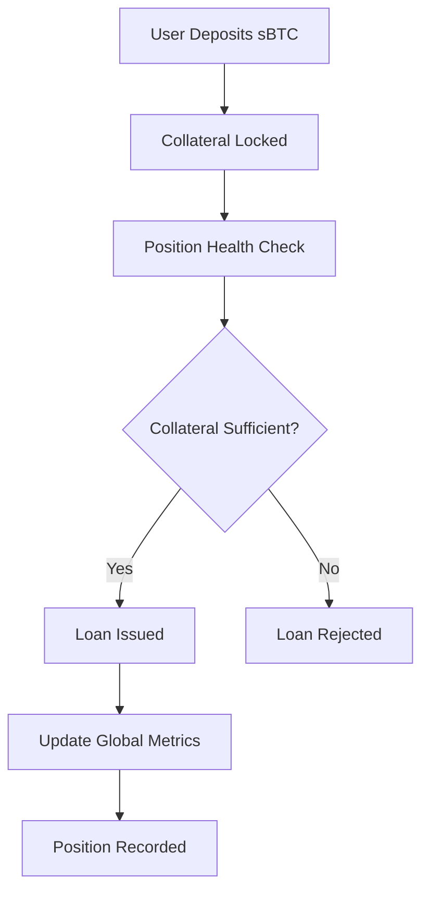
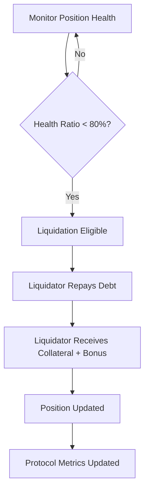

# StackLend Protocol

**Bitcoin-Native Decentralized Lending Infrastructure on Stacks**

[](https://opensource.org/licenses/MIT)
[](https://docs.stacks.co/clarity)
[](https://github.com/bashiru-tijani/StackLend)

## Overview

StackLend transforms Bitcoin capital efficiency by creating the first truly Bitcoin-native lending protocol on Stacks. By leveraging sBTC as pristine collateral, users can unlock liquidity from their Bitcoin holdings while maintaining exposure to BTC's long-term value appreciation.

### Key Features

- **Bitcoin-Native Collateral**: Utilize sBTC as high-quality collateral
- **Overcollateralized Lending**: 150% minimum collateralization ratio ensures protocol security
- **Automated Liquidations**: MEV-protected liquidation engine with built-in incentives
- **Dynamic Risk Management**: Real-time interest rate adjustments and health monitoring
- **Emergency Circuit Breaker**: Administrative safeguards for protocol security

## System Architecture

### Core Components

```
┌─────────────────┐    ┌─────────────────┐    ┌─────────────────┐
│   Collateral    │    │    Lending      │    │   Liquidation   │
│    Manager      │    │     Engine      │    │     Engine      │
└─────────────────┘    └─────────────────┘    └─────────────────┘
         │                       │                       │
         └───────────────────────┼───────────────────────┘
                                 │
                    ┌─────────────────┐
                    │  Risk Analytics │
                    │     Module      │
                    └─────────────────┘
```

### Contract Architecture

The StackLend protocol is implemented as a single Clarity smart contract with the following key modules:

#### 1. **State Management Layer**

- Protocol configuration variables
- User position tracking
- Global metrics aggregation

#### 2. **Core Operations Layer**

- Collateral deposit and withdrawal
- Loan origination and repayment
- Position liquidation

#### 3. **Risk Management Layer**

- Collateral ratio validation
- Health score calculations
- Liquidation threshold monitoring

#### 4. **Administrative Layer**

- Interest rate adjustments
- Risk parameter updates
- Emergency pause functionality

## Data Flow

### Lending Process Flow



### Liquidation Process Flow



## Protocol Parameters

### Risk Management Constants

| Parameter | Value | Description |
|-----------|-------|-------------|
| Minimum Collateral Ratio | 150% | Required overcollateralization |
| Liquidation Threshold | 80% | Health ratio trigger for liquidation |
| Maximum APR | 100% | Interest rate ceiling |
| Minimum APR | 1% | Interest rate floor |
| Liquidation Bonus | 5% | Liquidator incentive |

### Error Codes

| Code | Error | Description |
|------|-------|-------------|
| u100 | `ERR-UNAUTHORIZED-ACCESS` | Caller lacks required permissions |
| u101 | `ERR-INSUFFICIENT-FUNDS` | Insufficient balance for operation |
| u102 | `ERR-COLLATERAL-SHORTFALL` | Inadequate collateral for loan |
| u103 | `ERR-INVALID-PARAMETERS` | Invalid function parameters |
| u104 | `ERR-PROTOCOL-INITIALIZED` | Protocol already initialized |
| u105 | `ERR-PROTOCOL-NOT-READY` | Protocol paused or not ready |
| u106 | `ERR-LIQUIDATION-CONDITIONS-NOT-MET` | Position not eligible for liquidation |

## Core Functions

### User Operations

#### `lock-collateral`

Deposits sBTC as collateral to enable borrowing.

```clarity
(lock-collateral (token-contract <bitcoin-token-standard>) (deposit-amount uint))
```

#### `execute-loan`

Borrows against deposited collateral with health ratio validation.

```clarity
(execute-loan (token-contract <bitcoin-token-standard>) (loan-amount uint))
```

#### `settle-debt`

Repays outstanding loan to improve position health.

```clarity
(settle-debt (token-contract <bitcoin-token-standard>) (repayment-amount uint))
```

### Liquidation Operations

#### `execute-liquidation`

Liquidates undercollateralized positions with liquidator rewards.

```clarity
(execute-liquidation (token-contract <bitcoin-token-standard>) (target-borrower principal) (liquidation-amount uint))
```

#### `claim-liquidation-rewards`

Claims accumulated liquidation bonuses.

```clarity
(claim-liquidation-rewards (token-contract <bitcoin-token-standard>))
```

### Administrative Functions

#### `adjust-interest-rate`

Updates the protocol interest rate (admin only).

```clarity
(adjust-interest-rate (new-rate uint))
```

#### `update-liquidation-threshold`

Modifies liquidation trigger threshold (admin only).

```clarity
(update-liquidation-threshold (new-threshold uint))
```

#### `activate-emergency-pause`

Pauses protocol operations for emergency situations.

```clarity
(activate-emergency-pause)
```

### Read-Only Functions

#### `get-protocol-analytics`

Returns comprehensive protocol health metrics.

```clarity
(get-protocol-analytics)
```

#### `get-collateral-position`

Retrieves user's collateral deposit information.

```clarity
(get-collateral-position (account principal))
```

#### `get-lending-position`

Returns user's borrowing position details.

```clarity
(get-lending-position (account principal))
```

## Security Features

### Mathematical Safety

- **Overflow Protection**: All arithmetic operations include overflow checks
- **Underflow Protection**: Secure subtraction prevents negative values
- **Division by Zero**: Safe division with zero-value handling

### Access Control

- **Administrative Functions**: Restricted to protocol administrator
- **Token Authorization**: Validates authorized collateral tokens
- **Emergency Pause**: Circuit breaker for critical situations

### Liquidation Protection

- **MEV Resistance**: Structured liquidation incentives prevent manipulation
- **Gradual Liquidation**: Prevents excessive liquidations
- **Bonus Caps**: Limits liquidator rewards to prevent exploitation

## Development Setup

### Prerequisites

- [Clarinet](https://docs.hiro.so/clarinet) v2.0+
- Node.js v18+
- TypeScript

### Installation

```bash
# Clone the repository
git clone https://github.com/bashiru-tijani/StackLend.git
cd StackLend

# Install dependencies
npm install

# Run tests
npm test

# Check contracts
clarinet check
```

### Testing

```bash
# Run all tests
npm run test

# Run tests with coverage
npm run test:report

# Watch mode for development
npm run test:watch
```

### Contract Validation

```bash
# Check contract syntax and semantics
clarinet check

# Format contracts
clarinet fmt

# Generate documentation
clarinet docs
```

## Deployment

### Testnet Deployment

```bash
# Deploy to testnet
clarinet deployments generate --testnet

# Apply deployment
clarinet deployments apply -p deployments/default.testnet-plan.yaml
```

### Mainnet Deployment

```bash
# Generate mainnet deployment plan
clarinet deployments generate --mainnet

# Review and apply
clarinet deployments apply -p deployments/default.mainnet-plan.yaml
```

## Risk Considerations

### Protocol Risks

- **Smart Contract Risk**: Inherent risks in smart contract execution
- **Liquidation Risk**: Potential for position liquidation during market volatility
- **Oracle Risk**: Dependency on price feed accuracy
- **Governance Risk**: Administrative control over critical parameters

### User Risks

- **Collateral Volatility**: sBTC price fluctuations affect position health
- **Interest Rate Risk**: Variable borrowing costs
- **Liquidation Penalty**: Loss of collateral during liquidation events

## Governance

The protocol includes administrative functions for:

- Interest rate management
- Risk parameter optimization
- Emergency response capabilities
- Protocol upgrades and maintenance

## Contributing

1. Fork the repository
2. Create a feature branch (`git checkout -b feature/amazing-feature`)
3. Commit your changes (`git commit -m 'Add amazing feature'`)
4. Push to the branch (`git push origin feature/amazing-feature`)
5. Open a Pull Request

### Development Guidelines

- Follow Clarity best practices
- Include comprehensive tests
- Document all public functions
- Ensure security considerations are addressed

## License

This project is licensed under the MIT License - see the [LICENSE](LICENSE) file for details.

## Acknowledgments

- Stacks Foundation for the Clarity language and Stacks blockchain
- Bitcoin community for inspiring Bitcoin-native DeFi innovation
- Open-source DeFi protocols for architectural inspiration
